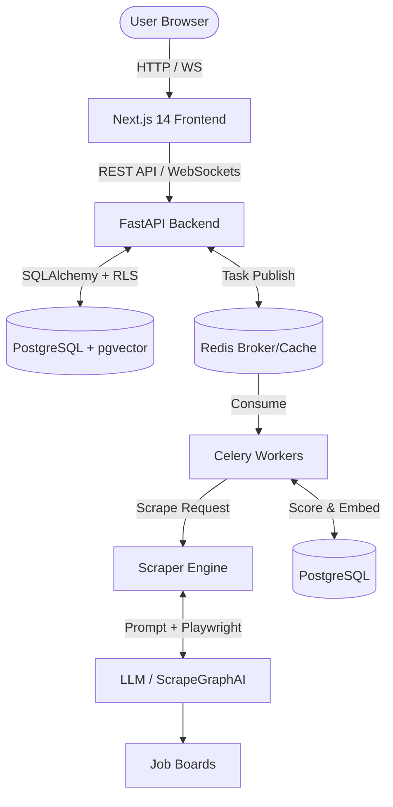

# LeadForge — AI-Powered Lead Generation Engine

<div align="center">
  

  <p>
    <strong>Automate job listing discovery, intelligent scoring, and contact extraction from multiple online job boards.</strong>
  </p>

  <p>
    
    
    
    
    
    
  </p>
</div>

---

**LeadForge** is an intelligent, end-to-end lead generation application. It leverages **ScrapeGraphAI** to scrape job postings from platforms like LinkedIn, Naukri, UpWork, and Indeed. Extracted data is normalized, stored securely using **PostgreSQL Row-Level Security (RLS)**, and enriched with **AI-powered relevance scoring** and **pgvector HNSW indexes** for semantic search.

Everything is served via a real-time **Next.js Dashboard** using **WebSockets** and processed asynchronously by **Celery**.

## 🌟 Key Features

*   **Multi-Platform Scraping** — Native support for LinkedIn, Naukri, UpWork, Indeed, Glassdoor, and Custom URLs.
*   **AI-Powered Extraction & Normalization** — Uses ScrapeGraphAI with LLMs (GPT-4o-mini / Claude) to extract and standardize structured data.
*   **Intelligent Lead Scoring** — Automatically scores leads based on relevance to your predefined preferences.
*   **Real-Time Dashboard** — WebSockets push live updates for scraping jobs and new leads directly to the frontend.
*   **Advanced Vector Search** — `pgvector` with HNSW indexing for hyper-fast semantic search of leads.
*   **Enterprise-Grade Security** — Row-Level Security (RLS) ensures full multi-tenant data isolation at the database level.
*   **Async Job Queue** — Celery + Redis architecture for non-blocking scraping and background processing.
*   **Notifications & Webhooks** — Email notifications (SMTP/SendGrid) and webhook integrations.
*   **Robust Testing** — Covered by Pytest (Backend) and Playwright End-to-End Tests (Frontend).

## 🏗️ Architecture Overview



## 🛠️ Tech Stack

| Layer | Technology |
|-------|-----------|
| **Frontend** | Next.js 14, React 18, TypeScript, Tailwind CSS, Recharts |
| **Backend** | FastAPI, Python 3.11+, SQLAlchemy 2.0 (Async), WebSockets |
| **Scraper** | ScrapeGraphAI, Playwright, BeautifulSoup, Custom Normalizers |
| **Queue & Cache** | Celery 5.3, Redis 7 |
| **Database** | PostgreSQL 16, pgvector (HNSW), Alembic Migrations |
| **AI/LLM** | OpenAI GPT-4o-mini, Anthropic Claude |
| **Auth & Security**| JWT, Row-Level Security (RLS) |
| **Deployment** | Docker, Docker Compose, Caddy (Reverse Proxy) |
| **Testing** | Pytest, Playwright E2E |

## 🚀 Quick Start

### Prerequisites
*   Docker & Docker Compose (v2.0+)
*   OpenAI API Key (or Anthropic API Key)
*   Python 3.11+ & Node.js 18+ (For manual development)

### 1. Clone & Configure

```bash
git clone https://github.com/Rcidshacker/lead-gen-app.git
cd lead-gen-app

# Copy environment files
cp .env.example .env
cp frontend/.env.local.example frontend/.env.local
```

Edit the `.env` file to include your secure credentials:
*   Set a secure `JWT_SECRET` (`python -c "import secrets; print(secrets.token_urlsafe(48))"`)
*   Provide your `OPENAI_API_KEY`.

### 2. Start with Docker Compose

LeadForge is bundled with a complete docker-compose setup, including Caddy for local deployment routing.

```bash
docker-compose up -d --build
```

This spins up:
1.  **PostgreSQL** (with pgvector)
2.  **Redis**
3.  **FastAPI Backend**
4.  **Celery Worker**
5.  **Celery Beat**
6.  **Next.js Frontend**
7.  **Caddy** (Reverse Proxy)

### 3. Access the Application

*   **Frontend Dashboard**: http://localhost:3000
*   **Backend API**: http://localhost:8000
*   **API Documentation**: http://localhost:8000/docs
*   **Health Check**: http://localhost:8000/health

## 📂 Project Structure

```text
lead-gen-app/
├── backend/              # FastAPI Application
│   ├── alembic/          # Database migrations (RLS, HNSW, etc.)
│   ├── app/
│   │   ├── api/          # REST & WebSocket route handlers
│   │   ├── models/       # SQLAlchemy models
│   │   ├── services/     # Scoring, Email, Webhooks logic
│   │   ├── workers/      # Celery async tasks
│   │   └── rls.py        # Row-Level Security implementation
│   └── tests/            # Pytest test suite
├── scraper/              # AI Scraper Engine
│   ├── extractors/       # LLM extractors
│   ├── scrapers/         # LinkedIn, UpWork, Indeed, etc.
│   └── utils/            # Normalizers, rate limiters, proxies
├── frontend/             # Next.js Application
│   ├── src/              # Pages, Components, Hooks
│   └── tests/e2e/        # Playwright tests
└── deploy/               # Caddyfile and deployment configs
```

## 🧪 Testing

### Backend (Pytest)
```bash
cd backend
pytest tests/ -v
```

### Frontend (Playwright E2E)
```bash
cd frontend
npx playwright test
```

## 📜 API Endpoints Overview

| Method | Endpoint | Description |
|--------|----------|-------------|
| `POST` | `/api/v1/auth/login` | Login and obtain JWT token |
| `WS` | `/api/v1/ws/dashboard` | WebSocket connection for real-time updates |
| `GET` | `/api/v1/leads` | Retrieve and filter leads |
| `GET` | `/api/v1/jobs` | Retrieve scraping jobs |
| `POST` | `/api/v1/sources/{id}/scrape`| Dispatch an async scraping task |

> For the full API specification, visit `http://localhost:8000/docs` while the backend is running.

## 🤝 Contributing

Contributions, issues, and feature requests are welcome!
Feel free to check the [issues page](https://github.com/Rcidshacker/lead-gen-app/issues).

## 📄 License

This project is licensed under the MIT License - see the [LICENSE](LICENSE) file for details.

## ⚠️ Disclaimer

This tool is designed for educational and internal workflow automation purposes. Please ensure you comply with the terms of service (TOS) of any platform you scrape.
